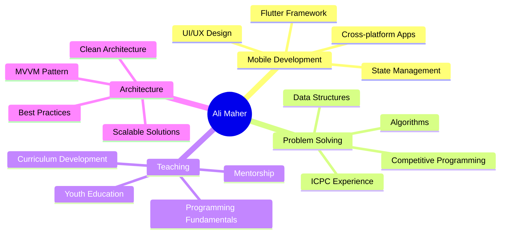

<div align="center">
  
# 🚀 Hi there, I'm Ali Maher Mohamed Hasan
## 💻 Flutter Developer | 🎓 CS Graduate | 👨‍🏫 Tech Instructor


---

### 🎯 **About Me**

```typescript
const aliMaher = {
    location: "Sohag, Egypt 🇪🇬",
    education: "Computer Science & AI Graduate - Sohag University",
    status: "Fresh Graduate 2024",
    currentFocus: "Mobile Development with Flutter",
    currentProject: "MediCare - Healthcare Platform",
    teachingAt: ["iSchool", "Ashbal Misr", "Baraem Misr"],
    languages: ["Dart", "Python", "Java"],
    hobbies: ["Competitive Programming", "UI/UX Design", "Teaching"],
    lookingFor: "Flutter Developer Opportunities"
};
```

---

## 🛠️ **Tech Stack & Tools**

<div align="center">

### 📱 **Mobile Development**


### 🗂️ **State Management**


### 🔧 **Programming Languages**


### ☁️ **Backend & Database**


### 🛠️ **Development Tools**


</div>

---

## 🔥 **Featured Projects**

<div align="center">

| 🏥 **MediCare** | 📚 **Bookly App** | 🛒 **Store App** |
|:---:|:---:|:---:|
| Healthcare Platform | Digital Library | E-Commerce Solution |
| `Flutter` `Firebase` `Clean Architecture` | `MVVM` `Cubit` `Firebase Auth` | `REST APIs` `Payment Integration` |
| [🔗 View Project](#) | [🔗 View Project](https://github.com/ALi-Maher-Mohamed) | [🔗 View Project](#) |

| 📝 **Notes App** | 🌦️ **Weather App** | 🎹 **Piano App** |
|:---:|:---:|:---:|
| Note Management | Weather Forecast | Interactive Piano |
| `Local Storage` `Clean UI` | `Location APIs` `Real-time` | `Sound Effects` `Animations` |
| [🔗 View Project](#) | [🔗 View Project](#) | [🔗 View Project](#) |

</div>

---

## 💼 **Professional Experience**

```yaml
👨‍🏫 Tech Instructor:
  organizations: [iSchool, Ashbal Misr, Baraem Misr Digital Initiatives]
  students_age: 8-18 years
  subjects: [Flutter Development, Programming Fundamentals]
  impact: Teaching next generation of developers
  duration: 2023 - Present

🎓 Fresh Graduate:
  degree: Bachelor of Computers & AI
  university: Sohag University
  graduation_year: 2025
  status: Seeking Flutter Developer opportunities

🏆 ICPC Competitor:
  focus: Competitive Programming
  skills: [Algorithm Design, Problem Solving, Optimization]
  achievements: Active participant in programming contests
```

---

## 📊 **GitHub Statistics**

<div align="center">
  
  
</div>

<div align="center">
  
</div>

---

## 🎓 **Education & Achievements**

<div align="center">

| 🎯 **Degree** | 🏛️ **University** | 📅 **Year** | 🏆 **Achievements** |
|:---:|:---:|:---:|:---:|
| Computer Science & AI | Sohag University | 2024 Graduate | ICPC Participant |
| Flutter Development | Self-taught | 2022-Present | 10+ Projects Completed |
| Teaching Certification | iSchool | 2023 | Youth Education Specialist |

</div>

---

## 🎯 **Core Skills**

<div align="center">



</div>

---

## 🌟 **My Development Philosophy**

<div align="center">

> 💡 **"I believe technology should enhance human experiences, not complicate them. Every line of code I write aims to create intuitive, beautiful, and impactful solutions that make a real difference in people's lives."**

### 🎯 **I Focus On:**
- ✨ **Quality**: Clean, maintainable code
- 🎨 **Design**: Modern, attractive user interfaces  
- 🚀 **Performance**: Fast, optimized applications
- 📱 **Experience**: User-friendly and accessible
- 🧠 **Learning**: Staying updated with latest technologies

</div>

---

## 🏆 **Graduation Project - MediCare**

<div align="center">

### 🏥 **Overview**
A comprehensive healthcare platform designed to connect patients with doctors through a seamless digital experience

| 🎯 **Objective** | ⚡ **Technologies** | 📱 **Features** |
|:---:|:---:|:---:|
| Improve Healthcare Access | Flutter, Firebase | Doctor Appointments |
| Connect Patients & Doctors | Clean Architecture | Doctor Ratings & Reviews |
| Enhanced User Experience | State Management | Medical Reports Management |

### 🔄 **Development Phases**
```
🔵 Planning & Design ✅
🔵 UI/UX Development ✅  
🟡 Backend Integration 🔄
⚪ Testing & Deployment ⏳
⚪ Launch & Maintenance ⏳
```

</div>

---

## 📈 **My Development Journey**

<div align="center">

### 📅 **Timeline**
```
2021 🎯 Started Programming Journey
2022 📱 Learned Flutter & Dart
2023 👨‍🏫 Started Teaching at iSchool
2024 🏥 Developed MediCare Project
2024 🎓 Graduated with CS & AI Degree
2024 🔍 Seeking Flutter Developer Role
```

### 💪 **Strengths**
- 🧠 **Problem Solving**: ICPC experience and competitive programming
- 🎨 **Creativity**: Designing attractive user interfaces
- 👥 **Teaching**: Sharing knowledge with next generation
- 🚀 **Passion**: Love for learning and continuous development
- 🎯 **Focus**: Dedicated to mobile development excellence

</div>

---

## 🎯 **Current Status & Goals**

<div align="center">

### 🔍 **Currently**
- 📱 **Seeking**: Flutter Developer opportunities
- 🏗️ **Building**: Portfolio of mobile applications
- 📚 **Learning**: Advanced Flutter techniques
- 👨‍🏫 **Teaching**: Programming to young developers

### 🎯 **Goals for 2024**
- ✅ Graduate with CS & AI degree
- 🎯 Land first professional Flutter developer role
- 🚀 Launch MediCare project
- 📈 Contribute to open-source Flutter projects
- 🏆 Advance in competitive programming

</div>

---

## 📞 **Let's Connect**

<div align="center">

### 🤝 **Let's Connect and Build Something Amazing Together!**

[](mailto:ali.maher0013@gmail.com)
[](https://linkedin.com/in/ali-maher-b59904223)
[](https://github.com/ALi-Maher-Mohamed)

---

### 📧 **Contact Information**
- 📱 **Location**: Sohag, Egypt 🇪🇬
- 🎓 **Education**: Computer Science & AI Graduate - Sohag University
- 💼 **Specialization**: Mobile App Development with Flutter
- 🌟 **Interests**: Competitive Programming, UI/UX Design, Teaching
- 🎯 **Status**: Fresh Graduate seeking Flutter Developer opportunities

---


### 🙏 **Thanks for Visiting My Profile!**
*If you like my work, don't forget to give ⭐ to my projects!*


</div>
