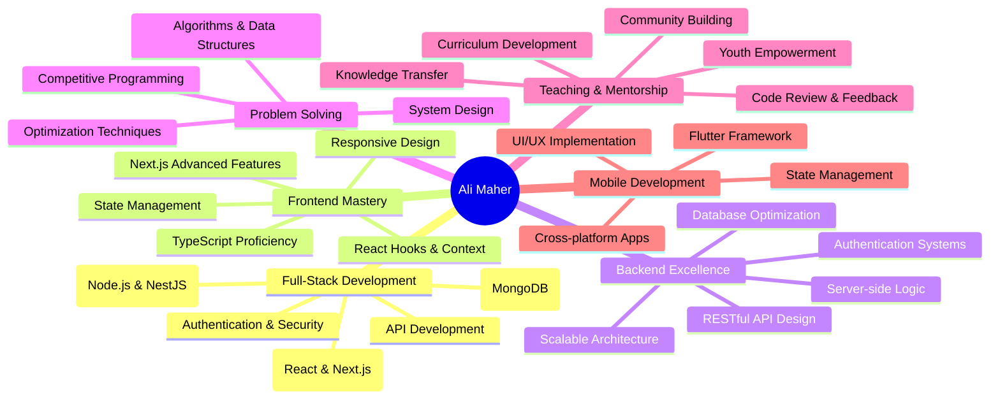

<div align="center">
  
# 🚀 Hi there, I'm Ali Maher Mohamed Hasan
## 💻 Software Engineer | 🎓 CS & AI Graduate | 🌐 Full-Stack Developer (MERN)


---

### 🎯 **About Me**

```typescript
const aliMaher = {
    location: "Sohag, Egypt 🇪🇬",
    education: {
        degree: "Bachelor of Computer Science & AI",
        university: "Sohag University",
        graduationDate: "June 2025",
        gpa: "Very Good (جيد جداً)"
    },
    currentFocus: "Full-Stack Web Development & Mobile Development",
    currentTraining: "ITI 9-Months Professional Program (Advanced MERN Stack)",
    specialization: ["React", "Next.js", "Node.js", "NestJS", "MongoDB"],
    teachingAt: ["Udacity", "Al-Mentor", "iSchool", "Ashbal Misr"],
    languages: ["JavaScript/TypeScript", "Python", "Java", "Dart"],
    hobbies: ["Competitive Programming", "UI/UX Design", "Mentoring", "Open Source"],
    lookingFor: "Junior Software Engineer Opportunities (Full-Stack / Frontend)"
};
```

---

## 🛠️ **Tech Stack & Tools**

<div align="center">

### 🌐 **Frontend Development**


### 🔧 **Backend Development**


### 🗄️ **Databases & ORMs**


### 📱 **Mobile Development**


### 🛠️ **Development Tools & Platforms**


### 💳 **Payment & Integration**


</div>

---

## 🔥 **Featured Projects**

<div align="center">

| 🏥 **MediCare** | 🚀 **Kernel Tech** | 📚 **Bookly App** |
|:---:|:---:|:---:|
| Healthcare Platform | Non-Profit Platform | Digital Library |
| `Flutter` `Firebase` `Clean Architecture` | `MERN` `Advanced Features` | `MVVM` `Cubit` `Firebase Auth` |
| Graduation Project | Production-Ready | E-Commerce |
| [🔗 View Project](#) | [🔗 View Project](#) | [🔗 View Project](#) |

| 🛒 **Full-Stack E-Commerce** | 💬 **Real-Time Chat App** | 🌐 **Modern Web Platform** |
|:---:|:---:|:---:|
| Complete E-Commerce Solution | Interactive Communication | Scalable Web App |
| `Next.js` `Stripe` `NestJS` `MongoDB` | `React` `WebSockets` `Node.js` | `React` `TypeScript` `Tailwind` |
| Production-Ready | Advanced Features | Best Practices |
| [🔗 View Project](#) | [🔗 View Project](#) | [🔗 View Project](#) |

</div>

---

## 💼 **Professional Experience & Training**

```yaml
🎓 ITI 9-Months Professional Program:
  status: Currently Enrolled
  focus: Full-Stack Web Development (MERN Stack)
  level: Advanced
  duration: 2025 - Present
  curriculum: React, Next.js, Node.js, NestJS, MongoDB, TypeScript
  impact: Intensive professional-grade training from industry experts

👨‍🏫 Tech Mentor & Instructor:
  platforms: [Udacity, Al-Mentor, iSchool, Ashbal Misr]
  students_age: 8-20+ years
  subjects: [Full-Stack Development, Frontend, Backend, Mobile Development]
  impact: Mentoring next generation of software engineers
  duration: 2023 - Present

🎓 Academic Achievement:
  degree: Bachelor of Computer Science & AI
  university: Sohag University
  graduation: June 2025
  gpa: Very Good (جيد جداً)
  thesis: Advanced Healthcare Platform (MediCare)

🏆 Competitive Programming:
  focus: Algorithm Design & Problem Solving
  experience: ICPC participant
  skills: [Data Structures, Algorithms, Optimization]
  achievements: Active problem solver on competitive platforms
```

---

## 📊 **GitHub Statistics**

<div align="center">
  
  
</div>

<div align="center">
  
</div>

---

## 🎓 **Education & Certifications**

<div align="center">

| 🎯 **Program/Degree** | 🏛️ **Institution** | 📅 **Duration** | 🏆 **Achievement** |
|:---:|:---:|:---:|:---:|
| ITI 9-Months Program | ITI (Information Technology Institute) | 2025-Present | Advanced MERN Stack |
| Bachelor in CS & AI | Sohag University | 2021-2025 | Graduated with "Very Good" Grade |
| Flutter Development | Self-taught + iSchool | 2022-2024 | 10+ Projects Completed |
| Full-Stack Web Dev | Self-taught + Udacity | 2024-Present | Production-Ready Apps |
| Teaching Certification | Multiple Platforms | 2023-Present | Certified Tech Mentor |

</div>

---

## 🎯 **Core Competencies**

<div align="center">


```mermaid
mindmap
  root((Ali Maher))
    Full-Stack Development
      Frontend (React & Next.js)
      Backend (Node.js & NestJS)
      Database Design (MongoDB)
      API Development
      Authentication & Security
    Frontend Mastery
      React Hooks & Context
      Next.js Advanced Features
      TypeScript Proficiency
      Responsive Design
      State Management
    Backend Excellence
      RESTful API Design
      Database Optimization
      Server-side Logic
      Authentication Systems
      Scalable Architecture
    Problem Solving
      Algorithms & Data Structures
      Competitive Programming
      System Design
      Optimization Techniques
    Teaching & Mentorship
      Knowledge Transfer
      Curriculum Development
      Code Review & Feedback
      Youth Empowerment
      Community Building
    Mobile Development
      Flutter Framework
      Cross-platform Apps
      State Management
      UI/UX Implementation
```

</div>

---

## 🌟 **My Development Philosophy**

<div align="center">

> 💡 **"I believe in building scalable, maintainable solutions that solve real-world problems. Every line of code I write follows best practices and contributes to creating intuitive, beautiful, and impactful digital experiences that genuinely improve people's lives."**

### 🎯 **I Focus On:**
- ✨ **Quality**: Clean, maintainable, production-ready code
- 🎨 **Design**: Modern, attractive, user-centric interfaces  
- 🚀 **Performance**: Fast, optimized, scalable applications
- 📱 **Experience**: Seamless, accessible user experiences
- 🧠 **Learning**: Staying at the forefront of technology
- 🤝 **Collaboration**: Strong teamwork and communication
- 📚 **Mentorship**: Sharing knowledge with the community

</div>

---

## 🏆 **Graduation Project - MediCare**

<div align="center">

### 🏥 **Overview**
A comprehensive healthcare platform designed to revolutionize patient-doctor interactions through a seamless digital experience. Combines cutting-edge mobile development with clean architecture principles.

| 🎯 **Objective** | ⚡ **Technologies** | 📱 **Key Features** |
|:---:|:---:|:---:|
| Improve Healthcare Access | Flutter, Firebase | Doctor Appointments Booking |
| Connect Patients & Doctors | Clean Architecture | Advanced Doctor Ratings & Reviews |
| Enhanced UX | State Management (BLoC) | Digital Medical Reports |
| Real-time Notifications | Push Notifications | User-friendly Dashboard |

### 🔄 **Development Status**
```
🔵 Planning & Design ✅
🔵 UI/UX Development ✅  
🔵 Backend Integration ✅
🟡 Testing & Refinement 🔄
⚪ Production Deployment ⏳
```

</div>

---

## 📈 **Professional Journey**

<div align="center">

### 📅 **Timeline**
```
2021 🎯 Started Programming Journey with Java & Python
2022 📱 Mastered Flutter & Dart, Built 10+ Mobile Apps
2023 👨‍🏫 Started Teaching at iSchool, Ashbal Misr
2024 🌐 Transitioned to Full-Stack Development (MERN)
2024 🏥 Developed MediCare Graduation Project
2025 🎓 Graduated with CS & AI Degree (Very Good)
2025 🚀 Enrolled in ITI Advanced Professional Program
2025 🔍 Seeking Junior Software Engineer Role
```

### 💪 **Key Strengths**
- 🧠 **Full-Stack Expertise**: MERN Stack mastery with production-ready applications
- 🎨 **Creative Problem Solver**: ICPC experience and competitive programming background
- 🌟 **UI/UX Conscious**: Designing beautiful and functional user interfaces
- 👥 **Effective Mentor**: Teaching and guiding next generation developers
- 🚀 **Growth Mindset**: Continuous learning and staying updated with technology trends
- 🎯 **Dedicated Professional**: Committed to writing clean, scalable code
- 📊 **Data-Driven**: Leveraging analytics and user feedback for better solutions

</div>

---

## 🎯 **Current Status & Career Goals**

<div align="center">

### 🔍 **Currently**
- 🎓 **Training**: Enrolled in ITI 9-Months Professional Program (Advanced MERN Stack)
- 🌐 **Building**: Production-ready full-stack web applications
- 📚 **Mastering**: Advanced TypeScript, NestJS, and scalable architecture patterns
- 👨‍🏫 **Mentoring**: Teaching full-stack development on Udacity and Al-Mentor
- 🔍 **Seeking**: Junior Software Engineer opportunities with growth potential

### 🎯 **Goals for 2025**
- ✅ Complete ITI 9-Months Professional Program with distinction
- 🎯 Land first professional Full-Stack Software Engineer role
- 🚀 Deploy multiple production-grade applications to cloud platforms
- 📈 Contribute to open-source MERN/React projects
- 🏆 Build strong professional network in tech community
- 💡 Develop personal brand as a versatile software engineer

### 🌍 **Long-term Vision**
- 🌟 Become a Senior Full-Stack Engineer
- 🏢 Work with innovative tech companies (startups or established firms)
- 🌐 Contribute to global open-source projects
- 👥 Lead technical teams and mentor junior developers
- 💼 Build scalable, impactful products that help millions of users

</div>

---

## 📞 **Let's Connect & Collaborate**

<div align="center">

### 🤝 **Let's Build Something Extraordinary Together!**

[](mailto:ali.maher0013@gmail.com)
[](https://linkedin.com/in/ali-maher-b59904223)
[](https://github.com/ALi-Maher-Mohamed)
[](#)

---

### 📧 **Contact & Professional Info**
- 📱 **Location**: Sohag, Egypt 🇪🇬
- 🎓 **Education**: Bachelor in Computer Science & AI (June 2025)
- 🌟 **Current Focus**: Full-Stack Web Development (MERN Stack)
- 💼 **Training**: ITI Advanced Professional Program (2025)
- 💡 **Expertise**: React, Next.js, Node.js, NestJS, MongoDB, TypeScript
- 🎯 **Status**: Fresh Graduate & ITI Trainee, Seeking Software Engineer Opportunities
- 🏢 **Availability**: Open for Full-time / Part-time / Freelance projects

---


### 🙏 **Thanks for Visiting My Profile!**
*If you like my work and find value in my projects, please give ⭐ to my repositories. Your support motivates me to keep building amazing things!*


---

**Last Updated**: February 2025 | Made with ❤️ by Ali Maher Mohamed Hasan

</div>
