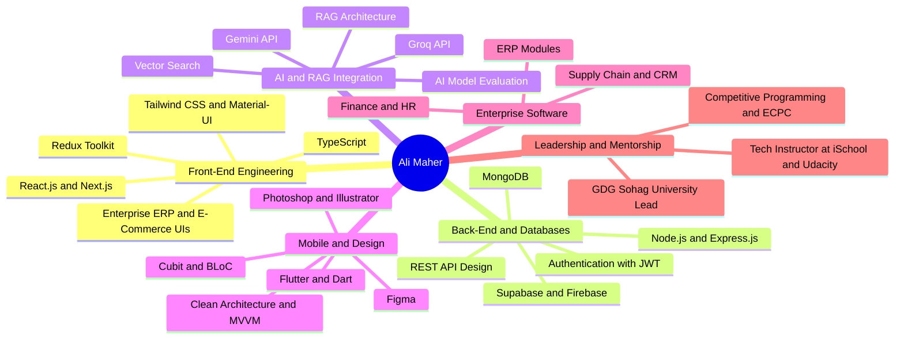

<div align="center">

# 🚀 Hi there, I'm Ali Maher Mohamed Hasan
## 💻 Software Engineer | Front-End Developer at Wazin 
### 🌐 Full-Stack Developer (MERN & Next.js) | 🎓 CS & AI Graduate


---

### 🎯 **About Me**

</div>

```typescript
const aliMaher = {
    location: "Sohag, Egypt 🇪🇬",
    education: {
        degree: "Bachelor of Computer Science & Artificial Intelligence",
        university: "Sohag University",
        graduationDate: "June 2025",
        grade: "Very Good (جيد جداً)"
    },
    training: "ITI 9-Months Professional Program Graduate - Full-Stack Web Development & UI",
    currentRoles: [
        "Front-End Developer @ Wazin (Enterprise ERP & E-Commerce)",
        "Software Engineer @ Value (Part-time - ERP Modules: Finance, HR, Supply Chain, CRM)",
        "Independent AI Trainer & Contractor @ Outlier & Scale AI (Project Aether, Core Evals)"
    ],
    communityLeadership: "Lead & Organizer - Google Developer Groups (GDG) on Campus, Sohag University",
    mentorship: "Tech Instructor & Mentor @ iSchool & Udacity",
    keyExpertise: ["AI & RAG Integration", "Full-Stack Architecture", "Mobile Development (Flutter)"],
    specialization: ["React.js", "Next.js", "TypeScript", "Node.js", "MongoDB"],
    languages: ["JavaScript/TypeScript", "Python", "Java", "Dart"],
    hobbies: ["Competitive Programming", "UI/UX Design", "Mentoring", "Open Source"]
};
```

---

<div align="center">

## 🛠️ **Tech Stack & Tools**

### 🌐 **Frontend Development**


### 🔧 **Backend & Databases**


### 🤖 **AI & Architecture**


### 📱 **Mobile & Design Tools**


### 🛠️ **Dev Tools & Platforms**


</div>

---

<div align="center">

## 🔥 **Featured Projects**

| 🏛️ **LegalMind** | 📝 **BlogPro** | 🏥 **MediCare** |
|:---:|:---:|:---:|
| AI Legal Assistant Web App | Full-Stack Blogging Platform | Healthcare Platform & Mobile App |
| `MERN` `Gemini API` `RAG Architecture` `Vector Search` | `MERN` `JWT` `Admin Dashboard` `Dark Mode` `AI Post Generation` | `Flutter` `Firebase` `Clean Architecture` |
| AI-Powered | Full-Stack | 🎓 Graduation Project |
| [🔗 View Project](#) | [🔗 View Project](#) | [🔗 View Project](#) |

| 🎓 **EduFlow / Kernel Tech** | 📚 **Bookly App** | ✈️ **Tripoo** |
|:---:|:---:|:---:|
| Educational Web Platform | Digital Library Mobile App | Travel & Booking App |
| `MERN` `Next.js` `Tailwind CSS` | `Flutter` `MVVM` `Cubit` | `Flutter` `Supabase` |
| Web Platform | Mobile | Mobile |
| [🔗 View Project](#) | [🔗 View Project](#) | [🔗 View Project](#) |

</div>

---

## 💼 **Professional Experience & Leadership**

```yaml
💻 Front-End Developer @ Wazin:
  domain: Enterprise ERP & E-Commerce
  focus: Scalable, performant front-end architecture
  stack: [React.js, Next.js, TypeScript, Tailwind CSS, Redux Toolkit]
  duration: 2026 - Present

🧩 Software Engineer @ Value (Part-time):
  domain: ERP Modules
  modules: [Finance, HR, Supply Chain, CRM]
  duration: 2026 - Present

🤖 Independent AI Trainer & Contractor @ Outlier & Scale AI:
  projects: [Project Aether, Core Evals]
  focus: AI model evaluation & quality
  duration: 2026 - Present

🌍 Lead & Organizer @ GDG on Campus, Sohag University:
  role: Google Developer Groups Chapter Lead
  impact: Building the local developer community through events and workshops
  duration: 2026 - Present

👨‍🏫 Tech Instructor & Mentor @ iSchool & Udacity:
  subjects: [Full-Stack Development, Frontend, Backend, Mobile Development]
  duration: 2023 - 2025

🎓 ITI 9-Months Professional Program (Graduate):
  focus: Full-Stack Web Development & UI
  curriculum: React, Next.js, Node.js, MongoDB, TypeScript
  year: 2025

🎓 Academic Achievement:
  degree: Bachelor of Computer Science & Artificial Intelligence
  university: Sohag University
  graduation: June 2025
  grade: Very Good (جيد جداً)
  thesis: MediCare - Healthcare Platform

🏆 Competitive Programming:
  focus: Algorithm Design & Problem Solving
  experience: ECPC participant (2024)
  skills: [Data Structures, Algorithms, Optimization]
```

---

## 📊 **GitHub Statistics**

<div align="center">
  
  
</div>

<div align="center">
  
</div>

---

## 🎓 **Education & Training**

<div align="center">

| 🎯 **Program/Degree** | 🏛️ **Institution** | 📅 **Duration** | 🏆 **Achievement** |
|:---:|:---:|:---:|:---:|
| B.Sc. Computer Science & AI | Sohag University | 2021 - 2025 | Graduated with "Very Good" |
| ITI 9-Months Professional Program | ITI (Information Technology Institute) | 2025 | Full-Stack Web Development & UI |
| Flutter & Dart Development | Self-taught | 2022 - 2024 | Multiple mobile apps built |
| Full-Stack Web (MERN & Next.js) | Self-taught + ITI | 2024 - Present | Production-ready applications |

</div>

---

## 🎯 **Core Competencies**

<div align="center">


```mermaid
mindmap
  root((Ali Maher))
    Front-End Engineering
      React.js and Next.js
      TypeScript
      Redux Toolkit
      Tailwind CSS and Material-UI
      Enterprise ERP and E-Commerce UIs
    Back-End and Databases
      Node.js and Express.js
      REST API Design
      MongoDB
      Supabase and Firebase
      Authentication with JWT
    AI and RAG Integration
      Gemini API
      Groq API
      RAG Architecture
      Vector Search
      AI Model Evaluation
    Mobile and Design
      Flutter and Dart
      Clean Architecture and MVVM
      Cubit and BLoC
      Figma
      Photoshop and Illustrator
    Enterprise Software
      ERP Modules
      Finance and HR
      Supply Chain and CRM
    Leadership and Mentorship
      GDG Sohag University Lead
      Tech Instructor at iSchool and Udacity
      Competitive Programming and ECPC
```

</div>

---

## 🌟 **My Development Philosophy**

<div align="center">

> 💡 **"I believe in building scalable, maintainable solutions that solve real-world problems. Every line of code I write follows best practices and contributes to creating intuitive, beautiful, and impactful digital experiences."**

### 🎯 **I Focus On:**
- ✨ **Quality**: Clean, maintainable, production-ready code
- 🎨 **Design**: Modern, user-centric interfaces
- 🚀 **Performance**: Fast, optimized, scalable applications
- 🤖 **Intelligence**: Practical AI & RAG integration in real products
- 🤝 **Collaboration**: Strong teamwork and communication
- 📚 **Mentorship & Community**: Sharing knowledge through teaching and GDG

</div>

---

## 🏆 **Graduation Project - MediCare**

<div align="center">

### 🏥 **Overview**
A healthcare platform and mobile app designed to improve patient-doctor interactions through a seamless digital experience, built with Flutter and Clean Architecture principles.

| 🎯 **Objective** | ⚡ **Technologies** | 📱 **Key Features** |
|:---:|:---:|:---:|
| Improve Healthcare Access | Flutter, Firebase | Doctor Appointment Booking |
| Connect Patients & Doctors | Clean Architecture | Doctor Ratings & Reviews |
| Enhanced UX | State Management (BLoC) | Digital Medical Reports |
| Real-time Updates | Push Notifications | User-friendly Dashboard |

</div>

---

## 📈 **Professional Journey**

<div align="center">

### 📅 **Timeline**
```
2021 🎓 Started B.Sc. in CS & AI at Sohag University
2022 📱 Mobile Development with Flutter & Dart
2023 👨‍🏫 Tech Instructor at iSchool & Udacity (2023 - 2025)
2024 🌐 Full-Stack Web Development (MERN) & ECPC Participation
2025 🎓 Graduated B.Sc. in CS & AI (Very Good) & Enrolled in ITI 9-Months Scholarship
2026 💼 Front-End Developer at Wazin | Software Engineer at Value
2026 🤖 AI Contractor at Outlier / Scale AI
2026 🌍 Lead at GDG on Campus, Sohag University
```

### 💪 **Key Strengths**
- 🧠 **Full-Stack Expertise**: MERN & Next.js applications from database to UI
- 🤖 **AI & RAG Integration**: Building AI-powered products with Gemini, Groq, and vector search
- 🏢 **Enterprise Experience**: ERP modules (Finance, HR, Supply Chain, CRM) and e-commerce front-ends
- 📱 **Cross-Platform Mobile**: Flutter apps with Clean Architecture and MVVM
- 🌟 **UI/UX Conscious**: Figma, Photoshop, and Illustrator design skills
- 👥 **Leader & Mentor**: GDG Sohag University lead, instructor at iSchool & Udacity

</div>

---

## 📞 **Let's Connect & Collaborate**

<div align="center">

### 🤝 **Let's Build Something Extraordinary Together!**

[](mailto:ali.maher0013@gmail.com)
[](https://linkedin.com/in/ali-maher-b59904223)
[](https://github.com/ALi-Maher-Mohamed)
[](#)

---

### 📧 **Contact & Professional Info**
- 📍 **Location**: Sohag, Egypt 🇪🇬
- 🎓 **Education**: B.Sc. Computer Science & AI, Sohag University (June 2025)
- 💼 **Current**: Front-End Developer @ Wazin | Software Engineer @ Value
- 🌟 **Focus**: Full-Stack (MERN & Next.js), AI & RAG Integration, Flutter
- 💡 **Expertise**: React.js, Next.js, TypeScript, Node.js, MongoDB, Supabase, Gemini API

---


### 🙏 **Thanks for Visiting My Profile!**
*If you like my work, please give ⭐ to my repositories. Your support keeps me building!*


---

**Last Updated**: October 2026 | Made with ❤️ by Ali Maher Mohamed Hasan

</div>
